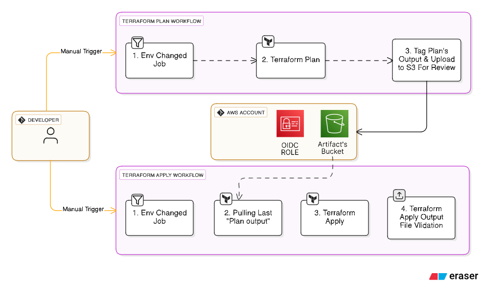

# CI/CD with GitHub Actions

## Purpose in this project

GitHub Actions workflows automate the entire software delivery lifecycle: **building, testing, scanning, signing, and deploying** microservices and infrastructure. All workflows use **OIDC-based authentication** (no long-lived credentials) and integrate with AWS ECR, EKS, and S3 for artifact storage.

## Folder structure overview

```
.github/
├── workflows/
│   ├── applications-microservice-Ci.yaml        # Microservices CI/CD pipeline
│   ├── infra-terraform-validate.yaml     # Terraform validation & security scanning
│   ├── infra-terraform-plan.yaml         # Terraform plan generation
│   └── infra-terraform-apply.yaml        # Terraform apply with approval gates
├── scripts/
│   ├── applications/
│   │   ├── resolve-service-configuration.sh       # Get service configuration from service.yaml
│   │   ├── initialize-service-directory.sh        # Resolve service directory path
│   │   ├── execute-java-test-suite.sh             # Maven lint, test, coverage
│   │   ├── scan-filesystem-vulnerabilities.sh     # Trivy filesystem vulnerability scan
│   │   ├── initialize-docker-buildx.sh            # Docker Buildx cache setup
│   │   ├── build-container-image.sh               # Multi-arch Docker image build
│   │   ├── publish-container-image.sh             # Push to ECR
│   │   ├── rotate-buildx-cache.sh                 # Cache cleanup
│   │   ├── sign-and-verify-container-image.sh     # Cosign keyless signing & verification
│   │   └── generate-image-security-sbom.sh        # Trivy image scan + SBOM generation
│   ├── infra/
│   │   ├── scan-terraform-security-checkov.sh     # Checkov IaC security scan
│   │   ├── scan-terraform-security-tfsec.sh       # tfsec IaC security scan
│   │   ├── generate-terraform-execution-plan.sh   # Terraform plan generation
│   │   └── synchronize-helm-image-tags.sh         # Helm values update helper
│   └── shared/
│       └── upload-build-artifacts-to-s3.sh        # Upload artifacts to S3
└── actions/
    ├── shared/
    │   └── env-setup/
    │       └── action.yaml              # AWS OIDC + ECR login composite action
    ├── applications/
    │   └── caching/
    │       └── action.yaml              # Docker cache management
    └── infra/
        └── terraform-setup/
            └── action.yaml              # Terraform installation & caching
```

**Key entry points**: `.github/workflows/*.yaml` (triggered on push/PR to `main`)

## How it works / design

### Microservices CI/CD pipeline (`applications-microservice-Ci.yaml`)

**Trigger**: Push/PR to `main` branch when `applications/accounts/`, `applications/cards/`, `applications/loans/`, or `applications/gateway/` directories change

**Pipeline stages**:
1. **Service detection**: `dorny/paths-filter` identifies changed services
2. **Lint & test**: Maven lint, unit tests, code coverage (parallelized per service)
3. **Trivy FS scan**: Filesystem vulnerability scanning before image build
4. **Build & push**: Docker Buildx multi-arch builds, push to ECR with tag `github.run_number`
5. **Image security**: Trivy image scan, SBOM generation (CycloneDX), Cosign keyless signing
6. **Artifact archival**: Uploads test reports, scan results, SBOMs, build metadata to S3

**OIDC authentication**: Uses `github-actions-eks-ecr-role` (created by Terraform `iam/github_oidc` module) for ECR push and S3 upload


### Terraform workflows

**Three-stage pipeline**:
1. **`terraform-validate.yaml`**: Runs `terraform fmt`, `validate`, Checkov, and tfsec scans; archives results to S3
2. **`terraform-plan.yaml`**: Generates Terraform plans (binary, text, JSON) for all environments; stores in S3 for review
3. **`terraform-apply.yaml`**: Applies Terraform with manual approval gate; requires uploaded plan artifacts for staging/prod





**Security scanning**: Checkov and tfsec scan Terraform code for misconfigurations, insecure defaults, and compliance violations

**Approval gates**: Production applies require manual approval and branch protection; dev can auto-approve

### Composite actions

- **`env-setup`**: Configures AWS credentials via OIDC, logs into ECR
- **`caching`**: Manages Docker Buildx cache for faster builds
- **`terraform-setup`**: Installs Terraform version, caches for reuse

## Key highlights

- **OIDC-based authentication**: No long-lived AWS credentials; short-lived tokens via GitHub OIDC provider
- **Security scanning**: Trivy scans (filesystem + image), Checkov/tfsec IaC scanning, Cosign image signing, SBOM generation
- **Artifact integrity**: All build artifacts (tests, scans, SBOMs, Terraform plans) archived to S3 for auditability
- **Parallel execution**: Service builds run in parallel matrix strategy
- **Multi-arch support**: Docker Buildx builds for `linux/amd64` and `linux/arm64`
- **Approval gates**: Terraform applies require manual approval for staging/prod, preventing accidental infrastructure changes
- **Change detection**: Path-based filtering only builds changed services, reducing CI/CD time and cost

## How to use / extend

### Trigger microservices CI

Push changes to `applications/accounts/`, `applications/cards/`, `applications/loans/`, or `applications/gateway/` directories:
```bash
git commit -m "Update accounts service"
git push origin main
```

### Run Terraform validation

Workflow auto-triggers on Terraform file changes, or manually trigger via GitHub Actions UI.

### Approve Terraform apply

1. **Plan stage**: `terraform-plan` workflow generates and uploads plans
2. **Review plans**: Download plans from S3 or view in workflow artifacts
3. **Approve apply**: `terraform-apply` workflow requires manual approval; click "Review deployments" in GitHub Actions UI

### Add a new service to CI

1. Add service directory to `paths` filter in `applications-microservice-Ci.yaml`:
```yaml
paths:
  - "applications/new-service/**"
```
2. Add service to `dorny/paths-filter` filters
3. Add service to matrix strategy

### Modify security scanning

Edit `.github/scripts/applications/scan-filesystem-vulnerabilities.sh` or `.github/scripts/infra/scan-terraform-security-checkov.sh` to adjust scan severity levels or add custom policies.

### View artifacts

All artifacts uploaded to S3 bucket `my-ci-artifacts55` under prefix `Ci-Artifacts/`. Access via AWS Console or CLI.

