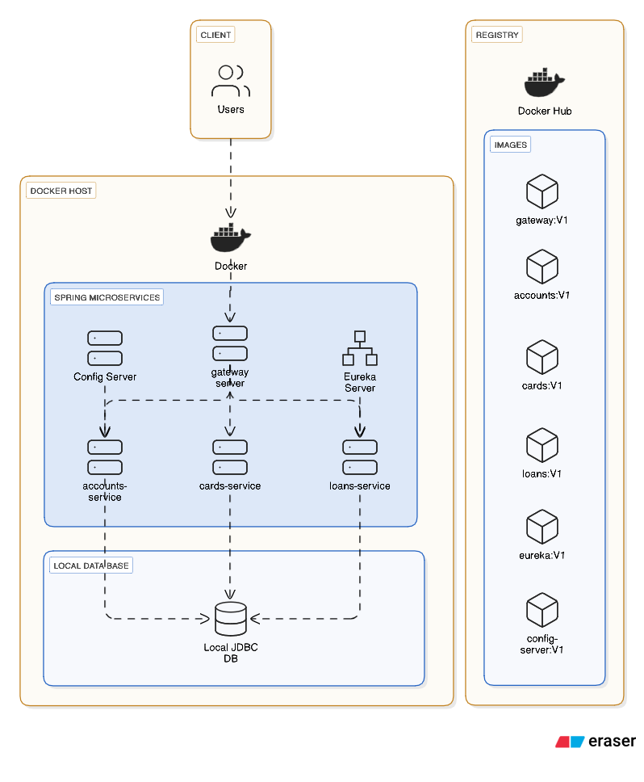

# Multi-Environment Banking Platform on AWS EKS

Enterprise Level cloud-native platform deploying banking microservices (accounts, cards, loans, gateway) across dev, staging, and production environments on AWS EKS with GitOps automation, security controls, and full observability.

## Badges


 

## High-Level Architecture

**Architecture Transformation**:
*Before: Docker Compose on single host*



*After: Multi-environment EKS platform with GitOps*


**Microservices Architecture**: Four Spring Boot microservices (accounts, cards, loans, gateway) deployed independently with service-per-chart Helm pattern.

**Deployment Model**: GitOps-driven deployments via Argo CD. Helm charts define application manifests, Argo CD syncs from Git to Kubernetes clusters. CI/CD pipelines build, scan, sign, and push container images to ECR.

**Environment Separation**: Three isolated EKS clusters (dev, staging, production) with separate Terraform state files, Argo CD projects, and monitoring stacks. Each environment has its own VPC, RDS instance, and ECR repositories.

**Infrastructure as Code**: Terraform modules provision all AWS resources (VPC, EKS, RDS, ECR, IAM). Remote state stored in S3 with DynamoDB locking per environment.

## Tech Stack

### Cloud & Infrastructure
- **AWS**: EKS (3 clusters: dev/stag/prod), VPC, RDS PostgreSQL, ECR, Secrets Manager, S3
- **Terraform**: 1.6.0+ (modular architecture, remote state in S3 + DynamoDB)
- **Karpenter**: Node autoscaling and cost optimization

### CI/CD
- **GitHub Actions**: OIDC-based authentication, automated workflows
- **Argo CD**: GitOps deployment automation with app-of-apps 

### Containers & Orchestration
- **Docker**: Container runtime
- **Kubernetes**: EKS 
- **Helm**: 3.13.0+ 

### Monitoring & Observability
- **Prometheus**: Metrics collection via Prometheus Operator
- **Grafana**: Dashboards and visualization
- **Loki**: Centralized log aggregation (S3 backend)
- **Tempo**: Distributed tracing
- **OpenTelemetry**: Java agent instrumentation and collector

### Security
- **Trivy**: Container and filesystem vulnerability scanning
- **Checkov/tfsec**: Terraform security scanning
- **Cosign**: Container image signing and verification
- **External Secrets Operator**: AWS Secrets Manager integration
- **Kyverno**: Policy-as-code enforcement (network policies, security contexts)
- **IRSA**: IAM Roles for Service Accounts (no long-lived credentials)

## Folder Structure

```
Multi-Environment-Microservices/
├── .github/
│   ├── workflows/                    # GitHub Actions CI/CD pipelines
│   │   ├── applications-*.yaml      # Service-specific CI/CD workflows
│   │   ├── deploy-applications.yaml  # Multi-service deployment orchestration
│   │   ├── service-discovery.yaml    # Auto-generates charts/workflows for new services
│   │   ├── infra-terraform-*.yaml   # Terraform validation, plan, apply workflows
│   │   └── infra-helm-lint.yaml     # Helm chart linting
│   ├── actions/                      # Reusable GitHub Actions
│   │   ├── applications/caching/     # Docker Buildx cache actions
│   │   ├── infra/terraform-setup/    # Terraform setup actions
│   │   └── shared/env-setup/         # AWS environment setup
│   ├── scripts/                      # CI/CD helper scripts
│   │   ├── applications/             # Service build, test, scan, sign scripts
│   │   ├── deployment/               # Deployment validation, health checks
│   │   ├── infra/                    # Terraform security scanning scripts
│   │   └── shared/                   # Common utilities
│   └── platform/                     # Service discovery and generation
│       ├── scripts/                  # Auto-generation scripts
│       └── schemas/                  # Service YAML schema validation
│
├── applications/                      # Microservice source code (Java/Spring Boot)
│   ├── accounts/                     # Accounts service
│   ├── cards/                        # Cards service
│   ├── loans/                        # Loans service
│   ├── gateway/                      # API Gateway service
│   └── payments/                     # Payments service
│
├── gitops/                           # Argo CD Application manifests (GitOps)
│   ├── config.yaml                   # GitOps configuration
│   ├── dev/                          # Development environment
│   │   ├── applications/              # Argo CD Applications
│   │   │   ├── app/                  # Main banking app
│   │   │   ├── monitoring/           # Monitoring stack apps
│   │   │   ├── infra/                 # Infrastructure apps (Karpenter)
│   │   │   └── access/                # Security apps (Kyverno, RBAC)
│   │   └── appprojects/              # Argo CD Projects (RBAC)
│   ├── stag/                         # Staging environment
│   └── prod/                         # Production environment
│
├── helm/                             # Helm charts
│   ├── bankingapp-common/            # Shared templates library
│   │   ├── templates/               # Reusable templates (deployment, service, HPA, etc.)
│   │   └── values.yaml              # Default values
│   ├── bankingapp-services/         # Service-specific charts
│   │   ├── _template/                # Template for new services
│   │   ├── accounts/                 # Accounts service chart
│   │   ├── cards/                    # Cards service chart
│   │   ├── loans/                    # Loans service chart
│   │   └── gateway/                  # Gateway service chart
│   └── environments/                # Environment app-of-apps charts
│       ├── dev-env/                  # Dev environment chart
│       ├── stag-env/                 # Staging environment chart
│       └── prod-env/                 # Production environment chart
│
├── infra/
│   ├── terraform/                    # Infrastructure as Code
│   │   ├── environments/             # Environment-specific configs
│   │   │   ├── dev/                  # Dev environment
│   │   │   │   ├── main.tf           # Resource composition
│   │   │   │   ├── variables.tf      # Input variables
│   │   │   │   ├── backend.tf        # Remote state (S3 + DynamoDB)
│   │   │   │   ├── provider.tf       # AWS provider config
│   │   │   │   ├── versions.tf       # Version constraints
│   │   │   │   └── dev.tfvars        # Environment values
│   │   │   ├── stag/                 # Staging environment
│   │   │   └── prod/                 # Production environment
│   │   ├── modules/                  # Reusable Terraform modules
│   │   │   ├── vpc/                  # VPC, subnets, security groups
│   │   │   ├── eks/                  # EKS cluster, node groups, operators
│   │   │   ├── rds/                  # RDS PostgreSQL instances
│   │   │   ├── ecr/                  # ECR repositories
│   │   │   ├── secrets/              # AWS Secrets Manager
│   │   │   ├── iam/                  # IAM roles (IRSA, OIDC, etc.)
│   │   │   └── monitoring/           # S3 buckets for Loki
│   │   └── shared/                   # Shared resources
│   └── karpenter/                    # Karpenter node autoscaling
│       ├── dev/                      # Dev NodePool and EC2NodeClass
│       ├── stag/                     # Staging NodePool and EC2NodeClass
│       └── prod/                     # Production NodePool and EC2NodeClass
│
├── monitoring/                       # Observability stack
│   ├── namespace.yaml                # Monitoring namespace
│   ├── prometheus-operator/         # Prometheus & Alertmanager
│   │   ├── alerts/                  # PrometheusRule resources
│   │   │   ├── application-alerts.yaml
│   │   │   ├── infrastructure-alerts.yaml
│   │   │   └── pod-alerts.yaml
│   │   └── values/                  # Environment-specific values
│   ├── loki/                        # Log aggregation
│   │   ├── templates/               # Loki Helm chart templates
│   │   └── values/                  # Environment-specific values
│   ├── promtail/                    # Log shipper (DaemonSet)
│   │   └── values/                  # Environment-specific values
│   ├── tempo/                       # Distributed tracing
│   │   └── values/                  # Environment-specific values
│   ├── opentelemetry-collector/     # OTEL collector
│   │   ├── config.yaml              # Base OTLP config
│   │   ├── config-{env}.yaml        # Environment-specific configs
│   │   └── values/                  # Environment-specific values
│   ├── dashboards/                  # Grafana dashboards
│   │   ├── dev/                     # Dev dashboards (YAML/JSON)
│   │   ├── prod/                    # Production dashboards (JSON)
│   │   └── staging/                 # Staging dashboards (JSON)
│   └── resources/                   # ResourceQuota & LimitRange
│
├── access/                          # Security policies and access control
│   ├── kyverno/                     # Kyverno policy-as-code
│   │   ├── policies/                # Cluster and namespace policies
│   │   │   └── cluster/              # Cluster-wide policies
│   │   ├── config/                  # Kyverno configuration
│   │   └── tests/                   # Policy test resources
│   └── rbac/                        # Kubernetes RBAC
│       ├── roles/                   # Cluster and namespace roles
│       ├── rolebindings/            # Role bindings
│       └── aws-auth/                 # EKS aws-auth ConfigMap
│
└── docs/                            # Documentation
    └── diagrams/                    # Architecture diagrams
```

## Key Components

### CI/CD (`.github/workflows`)
Automated pipelines for service builds, security scanning (Trivy, Checkov, tfsec), image signing (Cosign), and deployments. Service discovery workflow auto-generates Helm charts and workflow files for new services. Terraform workflows handle infrastructure validation, planning, and applying per environment.

### Infrastructure (`infra/terraform`)
Modular Terraform code managing VPC, EKS clusters, RDS databases, ECR repositories, and IAM roles (IRSA, GitHub OIDC, ALB Controller, ESO). Remote state in S3 with DynamoDB locking. Environment-specific configurations in separate folders (dev/stag/prod).

### Karpenter (`infra/karpenter`)
Node autoscaling configuration per environment. Dev/staging use spot instances for cost optimization; production uses on-demand for stability. Consolidation policies and instance type requirements defined per environment.

### Helm (`helm`)
Service-per-chart architecture with shared templates (`bankingapp-common`). Environment charts compose all services and are consumed by Argo CD. Implements best practices: resource requests/limits, HPA, security contexts, network policies, health probes.

### GitOps (`gitops`)
Argo CD Application manifests organized by environment. App-of-apps pattern: root application references environment Helm charts. Automated sync with self-heal and prune enabled. Separate Argo CD projects per environment with RBAC restrictions.

### Monitoring (`monitoring`)
Complete observability stack: Prometheus Operator for metrics, Grafana for dashboards, Loki for logs (S3 backend), Tempo for traces, OpenTelemetry Collector for instrumentation. Environment-specific configurations and pre-configured dashboards.

### Services (`applications`)
Four Spring Boot microservices: accounts, cards, loans, and gateway. Each service has its own Helm chart, CI/CD pipeline, and ECR repository. Deployed via GitOps to all environments.

---

## Documentation

- **[CI/CD Workflows](.github/workflows/README.md)**: Pipeline stages, service discovery, Terraform workflows
- **[GitOps](gitops/README.md)**: Argo CD configuration, sync policies, environment separation
- **[Helm Charts](helm/README.md)**: Chart structure, best practices, service deployment
- **[Terraform](infra/terraform/README.md)**: Infrastructure modules, remote state, security practices
- **[Karpenter](infra/karpenter/README.md)**: Node autoscaling configuration and cost optimization
- **[Monitoring](monitoring/README.md)**: Observability stack, dashboards, audit procedures

---

## Quick Start

### Prerequisites
- Terraform >= 1.6.0
- Helm >= 3.13.0
- kubectl >= 1.28.0
- AWS CLI configured

### Provision Infrastructure
```bash
cd infra/terraform/environments/dev
terraform init
terraform plan -var-file=dev.tfvars
terraform apply -var-file=dev.tfvars
```

### Access Cluster
```bash
aws eks update-kubeconfig --name bankingapp-dev-eks --region us-east-1
kubectl get nodes
```

### Access Argo CD
```bash
kubectl port-forward svc/argocd-server -n argocd 8080:443
# Get password: kubectl -n argocd get secret argocd-initial-admin-secret -o jsonpath="{.data.password}" | base64 -d
```

---

## Production Readiness

- ✅ Multi-environment isolation (3 separate EKS clusters)
- ✅ Infrastructure as Code (Terraform with remote state)
- ✅ GitOps automation (Argo CD with self-healing)
- ✅ Security hardening (IRSA, ESO, Kyverno, network policies, image signing)
- ✅ Complete observability (Prometheus, Grafana, Loki, Tempo)
- ✅ Automated CI/CD (GitHub Actions with OIDC, scanning, signing)
- ✅ Resource management (HPA, ResourceQuota, LimitRange, PDBs)
- ✅ High availability (multi-AZ, PodDisruptionBudgets)
