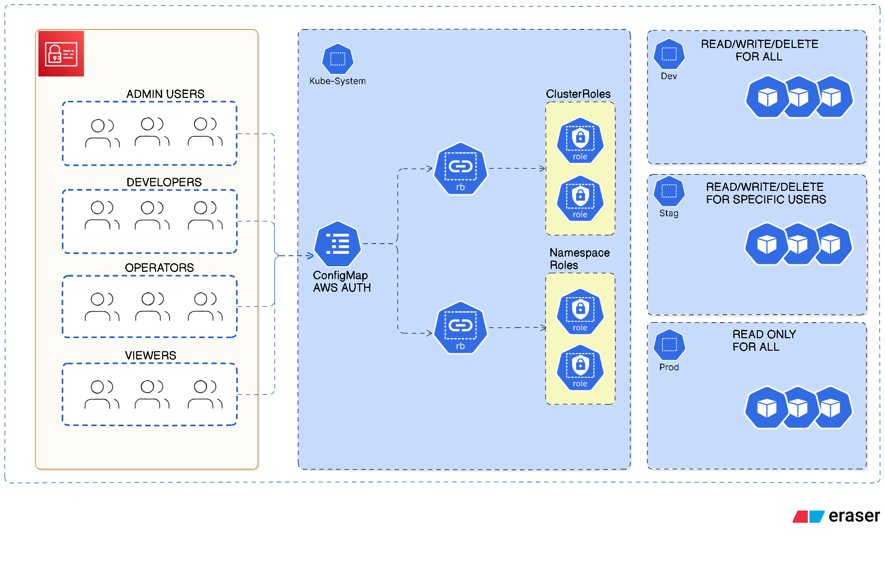

# Access Control & Security Policies

Security policies and access control configurations for the multi-environment EKS platform. Includes Kyverno policy-as-code and Kubernetes RBAC.

## Components

### Kyverno (`kyverno/`)

**Policy-as-Code Engine**: Kyverno validates, mutates, and generates Kubernetes resources using declarative policies.

**Key Policies**:
- **Image Security**: Requires Cosign signatures, restricts ECR registry, enforces semantic versioning
- **Container Security**: Blocks privileged containers, enforces non-root users, requires resource limits
- **Network Security**: Requires NetworkPolicy resources for zero-trust networking
- **Configuration Security**: Denies empty environment variables, blocks hostPath mounts

**Deployment**: Policies deployed via Argo CD as ClusterPolicy resources. See `gitops/{env}/applications/access/kyverno-policies-{env}.yaml`.

### RBAC (`rbac/`)

**Role-Based Access Control**: Kubernetes RBAC for user and service account authorization.

**Cluster Roles**:
- `cluster-admin`: Full cluster access
- `cluster-developer`: Create/update resources in all namespaces
- `cluster-operator`: Manage deployments (no RBAC modification)
- `cluster-viewer`: Read-only access

**Namespace Roles**:
- `namespace-admin`: Full namespace access
- `namespace-developer`: Create/update resources in namespace
- `namespace-viewer`: Read-only namespace access

**Role Bindings**: Assign roles to IAM users/groups via `aws-auth` ConfigMap or direct RoleBindings.

**Deployment**: RBAC resources deployed via Argo CD. See `gitops/{env}/applications/access/rbac-{env}.yaml`.

## Integration

**GitOps**: Both Kyverno policies and RBAC resources are managed via Argo CD, ensuring version control and auditability.

**Environment Separation**: Separate policy sets per environment (dev/stag/prod) with environment-specific restrictions.

**AWS Integration**: RBAC integrates with AWS IAM via EKS `aws-auth` ConfigMap for user authentication.

