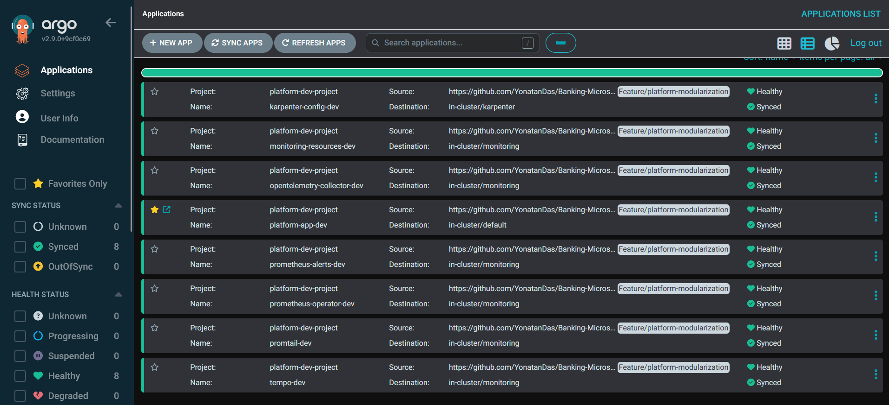

# GitOps with Argo CD

All applications are deployed via Argo CD using a GitOps model. Kubernetes resources are defined in Git, and Argo CD continuously synchronizes the cluster state to match the Git repository.



## Argo CD Resources

**Application Manifests**: Argo CD `Application` resources define what to deploy, where to deploy it, and how to sync it. Located in `gitops/{dev,stag,prod}/applications/`.

**App Projects**: Argo CD `AppProject` resources enforce RBAC and source restrictions per environment. Located in `gitops/{dev,stag,prod}/appprojects/`.

**App-of-Apps Pattern**: Root application (`banking-app-{env}.yaml`) references the environment Helm chart (`helm/environments/{env}-env/`), which composes all microservice charts.

## Environment Separation

**Separate Applications per Environment**: Each environment (dev, staging, production) has its own set of Argo CD Applications:
- `gitops/dev/applications/` - Development environment
- `gitops/stag/applications/` - Staging environment  
- `gitops/prod/applications/` - Production environment

**Argo CD Projects**: Each environment has a dedicated `AppProject` that restricts:
- Source repositories (only this Git repository)
- Destination namespaces (environment-specific namespaces)
- RBAC permissions (who can manage applications in this environment)

**Cluster Isolation**: Each environment runs in a separate EKS cluster, ensuring complete isolation.

## Sync Policies

**Automated Sync**: Applications are configured with `syncPolicy.automated`:
- `prune: true` - Automatically delete resources removed from Git
- `selfHeal: true` - Automatically revert manual cluster changes to match Git state

**Sync Options**:
- `CreateNamespace=true` - Automatically create target namespaces
- `PrunePropagationPolicy=foreground` - Wait for dependent resources before deletion
- `ServerSideApply=true` - Required for ClusterPolicy resources (Kyverno)

**Ignore Differences**: Applications ignore certain fields to prevent drift:
- Deployment replica counts (managed by HPA)
- Secret data (updated by External Secrets Operator)
- Service annotations (added by ALB Controller)
- ConfigMap annotations and certain data fields

## Deployment Strategy

**Rolling Updates**: Default Kubernetes rolling update strategy (configured in Helm charts).

**Sync Windows**: Production applications can be configured with sync windows to prevent deployments during business hours (if configured in Argo CD).

**Manual Sync**: Applications can be manually synced via Argo CD UI or CLI:
```bash
argocd app sync banking-app-dev
```

## Application Structure

**Main Application**: `banking-app-{env}.yaml` points to `helm/environments/{env}-env/` chart, which includes all microservices.

**Monitoring Applications**: Separate applications for each monitoring component:
- `prometheus-operator-{env}.yaml`
- `grafana-dashboards-{env}.yaml`
- `loki-stack-{env}.yaml`
- `promtail-{env}.yaml`
- `tempo-{env}.yaml`
- `opentelemetry-collector-{env}.yaml`

**Infrastructure Applications**: Karpenter configuration and monitoring resources:
- `karpenter-config-{env}.yaml`
- `monitoring-resources-{env}.yaml`

**Access Control Applications**: Security policies and RBAC:
- `kyverno-policies-{env}.yaml`
- `rbac-{env}.yaml`

## Integration with CI/CD
**Manual Deployment**: CI/CD workflows can trigger Argo CD syncs after image pushes, or rely on Argo CD's automated sync to detect new image tags in Helm values.
