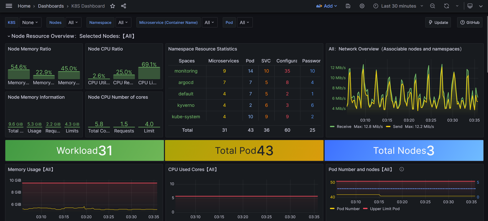

# Observability & Monitoring Stack

Complete observability stack providing metrics, logs, and traces for the banking microservices platform. All components are deployed via Helm charts and managed by Argo CD.

## Monitoring Tools

### Prometheus (Metrics)

**What It Does**: Collects and stores metrics from microservices and Kubernetes infrastructure. Scrapes metrics from Spring Boot Actuator endpoints (`/actuator/prometheus`) via ServiceMonitors.

**Configuration Location**: 
- Helm chart: `monitoring/prometheus-operator/`
- Values per environment: `monitoring/prometheus-operator/values/{dev,prod,staging}.yaml`
- Alerting rules: `monitoring/prometheus-operator/alerts/`

**Features**:
- ServiceMonitor CRDs for automatic service discovery
- PrometheusRule resources for alerting
- Environment-specific retention and storage configs
- Integration with Alertmanager for notifications

### Grafana (Dashboards & Visualization)



**Configuration Location**:
- Dashboards: `monitoring/dashboards/{dev,prod,staging}/`
- Dashboard formats: YAML (dev) and JSON (prod/staging)
- Datasources: Automatically configured for Prometheus, Loki, and Tempo

**Dashboards**:
- Application Overview: Service health, request rates, error rates
- Distributed Tracing: Service dependency graphs and trace exploration
- Kubernetes Pods: Resource usage, pod status
- JVM Metrics: Memory, GC, thread pools

### Loki (Log Aggregation)

**What It Does**: Centralized log aggregation system. Collects logs from all pods via Promtail and stores them in S3 for long-term retention.

**Configuration Location**:
- Helm chart: `monitoring/loki/`
- Values per environment: `monitoring/loki/values/{dev,prod,staging}.yaml`
- S3 backend: Configured via Terraform (`infra/terraform/modules/monitoring/`)

**Features**:
- S3 backend for durable, scalable log storage
- IRSA role for S3 access (no credentials in pods)
- Log labeling by namespace, pod, container for efficient querying
- Integration with Grafana for log exploration

### Tempo (Distributed Tracing)

**Configuration Location**:
- Helm chart: `monitoring/tempo/`
- Values: `monitoring/tempo/values/dev.yaml`
- Object storage: Configured for trace storage

**Features**:
- Trace storage in object storage
- Integration with Grafana for trace visualization
- Trace correlation with logs (via Loki) and metrics (via Prometheus)

### OpenTelemetry Collector

**Configuration Location**:
- Helm chart: `monitoring/opentelemetry-collector/`
- Base config: `monitoring/opentelemetry-collector/config.yaml`
- Environment configs: `monitoring/opentelemetry-collector/config-{dev,prod,staging}.yaml`
- Values: `monitoring/opentelemetry-collector/values/{dev,prod,staging}.yaml`

**Features**:
- OTLP receiver (gRPC port 4317, HTTP port 4318)
- Trace processing and forwarding to Tempo
- Java agent injection via Helm charts (init container downloads agent)

### Promtail (Log Shipper)

**Configuration Location**:
- Helm chart: `monitoring/promtail/`
- Values per environment: `monitoring/promtail/values/{dev,prod,staging}.yaml`

**Features**:
- Automatic log discovery from all pods
- Labeling by namespace, pod, container
- Efficient log forwarding to Loki

### Alertmanager

**Configuration Location**:
- Part of Prometheus Operator Helm chart
- Alerting rules: `monitoring/prometheus-operator/alerts/`
  - `application-alerts.yaml` - Application-specific alerts (pod crashes, high error rates)
  - `infrastructure-alerts.yaml` - Infrastructure alerts (node issues, resource exhaustion)

## How to Audit the System

### View Metrics and Dashboards

**Access Grafana**:
```bash
kubectl port-forward -n monitoring svc/prometheus-operator-grafana 3000:80
# Open http://localhost:3000
# Default credentials: admin / prom-operator
```

**Available Dashboards**:
- Application Overview: Service health, request rates, error rates, response times
- Distributed Tracing: Service dependency graphs, trace timelines
- Kubernetes Pods: Resource usage (CPU, memory), pod status
- JVM Metrics: Heap usage, GC metrics, thread pools

**Query Prometheus Directly**:
```bash
kubectl port-forward -n monitoring svc/prometheus-operator-kube-p-prometheus 9090:9090
# Open http://localhost:9090
```

### Search Logs

**Access Loki via Grafana**:
1. Open Grafana (see above)
2. Navigate to "Explore" → Select "Loki" datasource
3. Query logs using LogQL:
   - `{namespace="default"}` - All logs from default namespace
   - `{app="accounts"}` - Logs from accounts service
   - `{namespace="default"} |= "ERROR"` - Error logs from default namespace

**Log Labels**: Logs are labeled by namespace, pod, container for efficient filtering.

### Inspect Traces

**Access Tempo via Grafana**:
1. Open Grafana → Navigate to "Explore" → Select "Tempo" datasource
2. Search traces by:
   - Service name
   - Trace ID (from logs)
   - Time range
3. View trace timelines, service dependencies, and span details

**Trace Correlation**: Traces can be correlated with logs (click trace ID in Loki to view trace in Tempo) and metrics (view service metrics during trace time range).

### View Alerts

**Prometheus Alerts**:
```bash
kubectl get prometheusrules -n monitoring
kubectl describe prometheusrule <rule-name> -n monitoring
```

**Alertmanager**:
```bash
kubectl port-forward -n monitoring svc/prometheus-operator-kube-p-alertmanager 9093:9093
# Open http://localhost:9093
```

**Alert Rules**:
- Application alerts: Pod crashes, high error rates, high latency
- Infrastructure alerts: Node issues, resource exhaustion, Argo CD sync failures

## Integration with Microservices

**ServiceMonitors**: Each microservice exposes a ServiceMonitor (defined in `helm/bankingapp-common/templates/_servicemonitor.tpl`) for Prometheus scraping.

**OpenTelemetry**: Java agent injected as init container in microservice pods, configured via Helm values. Traces sent to OpenTelemetry Collector.

**Network Policies**: Monitoring namespace allowed in NetworkPolicy egress rules for metrics/logs/traces collection.

## Multi-Environment Isolation

**Separate Instances**: Each environment (dev/staging/prod) has its own Prometheus, Loki, and Tempo instances, preventing cross-environment data leakage.

**Environment-Specific Configs**: All monitoring components have environment-specific Helm values for retention, storage, and resource limits.
